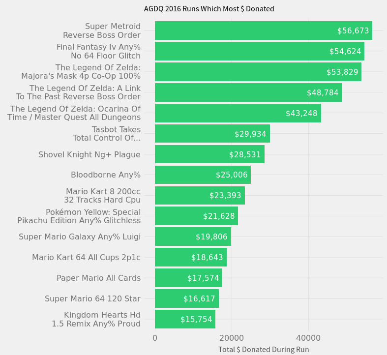

# GDQ Donation Analysis

## Authors

Kevin C. Hardy, New Mexico Tech

## Abstract

The biannual Games Done Quick events, hosted on Twitch.tv, raise money for the Prevent Cancer Foundation and Doctors Without Borders. These events grow larger each year and donation data is publicly available. In this paper, we scrape the available data with the Scrapy library for Python as well as analyze and visualize the dataset in R and Minitab. The GDQ events' donation totals grow linearly year to year, and the mean and median donation also grow significantly. A few games and games series', including Super Metroid and the Zelda series, repeat in raising top donation totals and significant portions of each event's overall donation totals.

## Index Terms

Data Analysis, Video Games, Donation, Game Done Quick, Awesome Games Done Quick, Summer Games Done Quick, AGDQ, SGDQ, Twitch.tv

## Introduction

Games Done Quick (GDQ) is a biannual speedrunning event streamed via Twitch.tv which encourages donating to Doctors Without Borders, the Prevent Cancer Foundation, or similar charties depending on the event. Over the course of multiple days, many participants in GDQ complete video games as fast as possible while viewers on Twitch.tv watch, chat via Twitch chat, and donate to charity through the GDQ website. There are two main events per year, namely Awesome Games Done Quick (AGDQ) in February and Summer Games Done Quick (SGDQ) in July. Both events have been gaining in popularity each year, raising considerably more money for charity each year. In this paper, we analyze the donations during AGDQ and SGDQ events from 2011 through 2017 using data from publicly available GDQ donation tracker.

## Previous Work

Max Woolf, A.K.A "minimaxir", analyzed donations for AGDQ 2016 in his blog article "Video Games and Charity: Analyzing Awesome Games Done Quick 2016 Donations." In his analysis, he visualized the cumulative donation total for AGDQ 2016, a histogram of donation amounts, and provided bar charts for donation amounts earned by both runs and bid incentives. This paper expands on Woolf's analysis by comparing different GDQ events.

## Tools

In this analysis, we scrape the data from the Games Done Quick website using the Python library Scrapy, merge the schedule and donation datasets using R, and apply data analysis and visualizations using R and Minitab.

## Data Collection

Game Done Quick donations and event schedules are available on their tracker https://gamesdonequick.com/tracker/. To collect the donation and schedule data, we can write a scraper. In this case, we use the Python library Scrapy. This resulted in JSON files representing donations and schedules for each event. We scrape all Summer Games Done Quick events from 2011 though 2016 and Awesome Games Done Quick events from 2012 through 2017. The necessary scraped donation data was the donation time and donation amount, though other unused attributes including each person's donor ID and whether or not they commented was scraped as well. The necessary scraped schedule data includes the run name (called "game" in our scraper), the run's start time, and the run's end time. Additional attributes, including the run description, players involved in the run, and whether or not the run is part of a bid incentive, were also scraped.

The resulting sets of donation and schedule JSON files then need to be merged. For this we load one of the schedule JSON files into R, set it to data frame called "runs", and write a function that returns the run name during given a datetime.

    timeRun <- function(x) {
        duringRun = (x > runs$starttime) & (x < runs$endttime)
        if (sum(duringRun, na.rm = T) > 0) {
            return (runs$game[which(duringRun)])
        }
    }

When running the above function with a time x that coincides with a run, it will return the run name. Using this function, we can do a mutation on a data frame of donations from that event to add a column to the donation table including the run name. If we load a JSON donations file into an R data frame called "donations", we can run the mutation as follows:

    donations <- donations %>% mutate(timeRun = sapply(time, timeRun))

The donations data frame now includes the columns donation amount, time of donation, and the run played during the donation. This data frame can be exported into a CSV file for further analysis in other tools. The process can be repeated for all of the scraped JSON files.

## Analysis

With the donations and associated runs for each GDQ event in a handful of CSV files, we can now analyze the data.

### Basic statistics

The mean of individual donation amounts for early SGDQ and AGDQ events, including SGDQ 2011, AGDQ 2012, SGDQ 2012, AGDQ 2013, and SGDQ2013 is $21.5 +/- $4, though it rose to $40 by AGDQ 2017. The median was $10 for the 2011 and 2012 events but rose to $15 and $25 depending on the individual event with the highest median being $25 during AGDQ2015. The number of donators also rose from 1,118 in SGDQ 2011 to 30,847 in SGDQ 2016, and from 5872 in AGDQ 2012 to 43,461 in AGDQ 2017. SGDQ 2011 raised $21,396 in total while SGDQ 2016 raised $992,553 in total. AGDQ 2012 raised $131,638 in total while AGDQ 2017 raised $1,790,550 in total. It's worth noting that each AGDQ and SGDQ event raised more money than each of their previous events, except for AGDQ 2016 which raised less money than AGDQ 2015. The higher medians indicate that each donator is donating more in general. The means being around double of the median indicate that high-value donors heavily skew the mean.

### Histograms

Viewing histograms of donation amounts for each event helps us understand the changes in overall donation behavior that result in higher means and medians, and shows us how many people are donating at different amounts. The histograms were generated in Minitab.

As expected based on the basic statistics, donations tend to be higher valued in later events. Especially notable is the growth in $50, $75, and $100 donations. The range of these histograms only shows donation values from $0 to $100, but some other high values such as $200 also show large growth from the old to more recent events.

### Highest contributing events

Since there are many runs of games in Games Done Quick, it is helpful to find out which events raise the most money overall. It might also be helpful to see which, if any, of the highest earning runs occur in many of the GDQ events.

The schedules for GDQ events before 2015 on the GDQ donation tracker are incomplete, so the 2011 through 2014 events won't be used for this part of the analysis. The following bar charts were generated in R.

Every GDQ event has at least one Zelda series game run, one Super Mario series game run as well as a Super Metroid run in the top 15 highest donation earning runs.

Super Metroid has a cultural reason to be in the top 15 for every GDQ event. Historically in the speedrunning community, it's always faster to leave a small group of alien animals to die in the final level of the game, but an early speedrunner beat the game so quickly that they both saved the animals (wasting around 25 seconds) and still beat the game's world record at the time. During every GDQ event, the bid incentive for "Save/Kill The Animals" has been a hotly debated topic and results in nearly equal bids for saving versus killing the animals. This is the most talked about bid during GDQ events.

The other high-earning runs likely come down to general game and game series popularity.

### Growth

We can also analyze growth of GDQ events overall. Since SGDQ events usually earn less than neighboring AGDQ events, SGDQ and AGDQ event totals grow at different rates. The growth also appears linear for each event, as we can see in the Linear regression plots.

Using the linear regression equations in the plots, we can predict the amounts that could be raised by the next events. We can expect SGDQ 2017 in July to raise around $941,119 and AGDQ 2018 in February to raise around $1,510,386. Whether the linear growth will actually continue for future events remains to be seen.

We can also plot the running totals of each event over time since the start of each event. What we can notice from this figure is that recent events raise money at somewhat comparable rates until the final hours of each event. At the end of each event, especially the recent AGDQ 2017, there is a spike of donations and an immediate dropoff once the events end.

## Discussion

Code and various artifacts of this project -- including the scraper, dataset, R workspace, Minitab file, and generated visualizations -- are available in this project's Github repository [1].

Running the code requires installing scrapy through PyPi. The dplyr and magrittr packages need to be installed in R to merge the schedule and donation data using the method in the available code.

## Conclusion

The growth of AGDQ and SGDQ events appears linear, so future donation totals could be predicted. The distribution of donation amounts seems to grow more even over the year, yielding a higher median and average donation. Multiple games and game series' repeatedly appear in the top fifteen games in relation to how much money they raise.

## Future work

There is still some work to be done to provide a more complete analysis. We did not compare donation incentives (bids) between GDQ events. Repeat donor behavior was also not analyzed, though it could be analyzed since we have donor ID's for repeat, non-anonymous donors. The SGDQ 2017 and AGDQ 2018 donation total predictions should also be checked when those events pass.

## References
1. Minimaxir SGDQ 2016 analysis
2. Python
3. Scrapy library
4. R
5. Minitab
6. Github project (PUT EVERYTHING ON GITHUB)